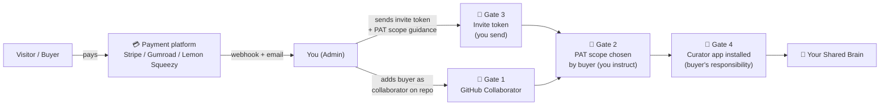
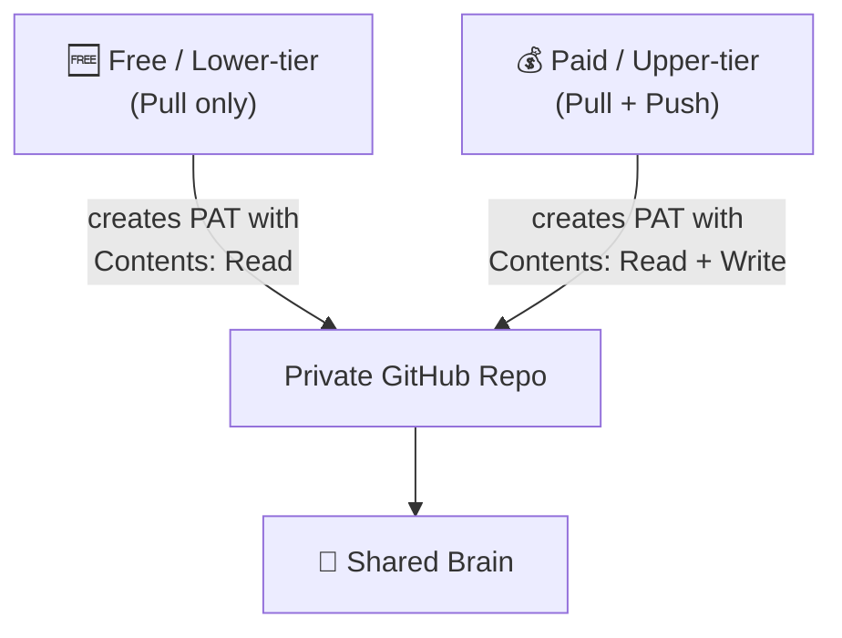

# Monetizing your Shared Brain

**For**: domain experts, researchers, artists, educators, scientists, consultants, and organisations who want to **charge for access** to a Shared Brain they've built. This guide explains how Shared Brain's architecture makes paid access possible **today**, with zero code changes, using no-code or low-code tools you already know.
**Companions**: [Shared Brain User Guide](shared-brain-user-guide.md) (setup walkthrough) · [Architecture](shared-brain.md) (how it works internally) · [Admin Operations](shared-brain-admin.md) (ongoing duties) · [Compliance Reference](shared-brain-compliance.md) (GDPR / IP / tax considerations)

> ⓘ This guide is for **brain admins who want to monetize**. If you just want to *join* a paid brain as a buyer, you only need the [User Guide](shared-brain-user-guide.md) — your admin handles all of this on their end.

---

## 1 — Why this is a real opportunity

The Curator's Shared Brain feature has a property that makes it uniquely suitable for paid knowledge products: **the brain compounds with every contribution**. A Notion template is bought once and frozen. A Shared Brain a buyer subscribes to keeps getting richer every week as you (and any other contributors) add reading, synthesis, and insights.

This means people will pay **subscription** prices for access — not just one-time fees — because the value keeps growing. Pricing comparables from adjacent markets:

| Product type | Typical pricing | Why people pay |
|---|---|---|
| Notion templates | €10-50 one-time | Static template |
| Substack newsletters | €5-15/month | Ongoing content stream |
| Patreon tiers | €3-50/month | Ongoing access + community |
| Subscription-based newsletters and learning communities | €10-30/month | Curated synthesis from someone trusted |
| Premium research subscriptions (Stratechery, Ben Thompson) | €15/month | Single expert's recurring insight |
| **A Shared Brain** | **€5-30/month** | **Compounding knowledge graph + recurring synthesis + searchable via Claude** |

Who's positioned well to monetize:

- **Independent researchers** (e.g. AI safety analyst with 4 years of paper reading)
- **University professors / PhDs** with deep niche expertise
- **Industry experts** (VC partners, biotech analysts, longevity researchers)
- **Artists / designers** sharing their visual reference brain + commentary
- **Specialist consultants** with curated client-engagement patterns
- **Subject-matter content creators** who already have audiences and want to convert them
- **Organisations** with high-value internal knowledge (consulting firms, research orgs, agencies)

---

## 2 — The architecture: knowing the "gates"

Before you set anything up, understand **where access is controlled** in Shared Brain. There are four gates, in series. Each one is a place where you (the admin) can charge money, restrict access, or revoke access.



### Gate 1 — GitHub collaborator (THE money gate)

This is **the** gate. Whether someone has paid or not, they cannot push or pull from the shared brain unless you've added them as a GitHub collaborator on the repo. Removing the collaborator status revokes their access immediately.

> 🔑 **All your access control happens here.** Pay → add collaborator. Cancel → remove collaborator. Refund → remove collaborator. This is the single gate you control 100%.

### Gate 2 — PAT scope (read-only vs read+write)

When the buyer creates their fine-grained Personal Access Token, you can instruct them to create it with either:

- **Contents: Read** — they can Pull the collective wiki but cannot Push (read-only tier)
- **Contents: Read AND write** — they can both Pull AND Push (full contributor tier)

The Curator wizard validates the scope at PAT-paste time and reports the result. This gives you **two distinct tiers** at the GitHub-permission level, no code needed.

### Gate 3 — Invite token (UX, not security)

The `sbi_…` invite token contains repo metadata (name, branch, folder slug). **It carries no credentials and grants no access by itself.** Its only job is to save the buyer from typing the repo URL into the wizard. You email it to buyers; you can also publish it publicly without security risk — Gate 1 still controls actual access.

### Gate 4 — Curator app installed

The buyer needs The Curator running on their own machine. Free, open-source, installs in ~5 minutes. Not a gate you control — it's a gate the buyer has to walk through themselves.

---

## 3 — Three monetization patterns

All three work today on v3.0.0-beta.1 with **zero code changes** to The Curator.

### Pattern A — Subscription access ("Substack for knowledge graphs")

**Pricing**: €5-30/month recurring.
**Best for**: ongoing research domains (AI papers, biotech, VC, longevity, security) where new content arrives weekly.
**Effort**: low setup, light ongoing (admin manually onboards each buyer, ~3 min/buyer).

How it works:

1. You sell monthly access via a payment platform (Gumroad, Lemon Squeezy, Stripe).
2. On payment, you receive an email/webhook with the buyer's email + a GitHub username they provided at checkout.
3. You add them as a collaborator on your private repo and send them the invite token.
4. They join the brain in their own Curator app.
5. Each week you ingest new reading into your personal opted-in domain, then Push + Run synthesis. Buyers Pull at their leisure.
6. Cancellation: payment platform notifies you → you remove them as collaborator. Their already-pulled local content stays on their machine (like canceling Spotify doesn't reclaim songs you downloaded for offline).

### Pattern B — One-time knowledge product (a "book that updates")

**Pricing**: €15-50 one-time.
**Best for**: finished bodies of work — e.g. *"100 hours of biotech VC reading 2020-2026, synthesised into 500 pages"*.
**Effort**: medium setup, near-zero ongoing.

How it works:

1. You spend weeks building a high-quality brain
2. List it as a one-time product on Gumroad/Lemon Squeezy
3. Buyers pay once → you add them as collaborator (could be read-only PAT) → they Pull everything once and keep their local copy
4. You may or may not continue updating the brain; either way, buyers got what they paid for at the moment of purchase

This is closest to selling a Notion template, but with the bonus that buyers can use it through Claude Desktop via the My Curator MCP for deep research over it.

### Pattern C — Free + sponsorship

**Pricing**: free brain, donations via GitHub Sponsors / Open Collective / Buy Me a Coffee.
**Best for**: experts who want maximum reach and accept that monetization is voluntary.
**Effort**: medium ongoing (you commit to running the brain free).

How it works:

1. You make the invite token public (e.g. on Twitter/X, your website)
2. Anyone can request to join — you add as collaborator for everyone willing to wait
3. Donate buttons let supporters give back. GitHub Sponsors is the simplest path for technical audiences.

---

## 4 — Tiered access (read-only vs read+write)

Many shared brains benefit from **two tiers** instead of one:



| Tier | What they can do | What they pay |
|---|---|---|
| **Read-only** | Pull the collective wiki, read everything, query via Claude (MCP) | Free or small one-time fee |
| **Contributor (read+write)** | Pull + Push their own reading and synthesis into the collective | Recurring monthly fee |

**Why this is powerful**: you let people sample the brain free (read-only) before they upgrade. People who genuinely contribute also pay for the privilege of being attributed in the Provenance of every page they enriched.

How to implement on day 1 (no code, just admin instructions):

1. When someone joins the read-only tier, you instruct them: *"When creating your PAT, set Contents permission to Read-only (NOT Read and write)."* The Curator wizard will show a yellow warning *"Token works but is read-only"* — for the read-only tier, that's the desired outcome. They can Pull but not Push.
2. When someone upgrades to contributor, instruct them: *"Re-create your PAT with Contents: Read AND write."* They re-paste in the wizard, the green ✓ appears, they can now Push.

---

## 5 — Step-by-step setup (Pattern A: Subscription)

This is the most common case. Steps are entirely no-code unless you want to optimise step 6.

### Step 1 — Build the brain (2-4 weeks before launching)

- Install The Curator on your machine ([install guide](../README.md#quick-start))
- Create a personal domain in the topic you want to monetize (e.g. `ai-safety-reading`)
- Ingest 100+ sources to make sure the brain has real content from day 1
- Test the MCP integration so you can demo "ask Claude about my brain" to prospective buyers

### Step 2 — Create the shared brain (5 minutes)

Follow the [admin setup walkthrough](shared-brain-user-guide.md#3--admin-setup-start-a-new-shared-brain):
1. Create a **private** GitHub repo (e.g. `your-username/ai-safety-brain`)
2. In the Curator's Sync tab, run the **⚙ I'm starting a new Shared Brain** wizard
3. Pick **organisational** data handling terms if you're selling to businesses (IP transfer to you), or **contributor_retains** if buyers' contributions should remain their own
4. Generate the invite token — save it somewhere accessible

### Step 3 — Choose your payment platform

| Platform | Best for | Notes |
|---|---|---|
| **Gumroad** | Solo creators, one-time + subscription | Easy setup, takes ~10% + fees |
| **Lemon Squeezy** | Higher-volume, EU-friendly Merchant of Record | Handles VAT for you globally; ~5% + fees |
| **Stripe Payment Links** | Direct, lowest fees | You handle VAT/sales tax yourself |
| **Patreon** | Audience already there | Best if you have an existing creator following |
| **Memberstack / Outseta** | Custom membership site | If you want a full custom landing page |

For most independent creators, **Lemon Squeezy** or **Gumroad** is the right starting point — both let you launch a paid product in under an hour with no code.

### Step 4 — Create your sales page

Outside The Curator's scope, but the essentials:

- **What the brain contains** — exact topic, scope, scale (e.g. "200 papers on mechanistic interpretability, weekly synthesis")
- **Who it's for** — your target buyer profile
- **What buyers receive** — invite token + access for X months
- **How they use it** — they install The Curator (free, open source) and connect using the wizard. Link to [the Curator's repo](https://github.com/talirezun/the-curator) and the [User Guide](shared-brain-user-guide.md).
- **Pricing & terms** — recurring? renewable? refund policy?
- **Demo** — a screenshot of the Curator showing a sample query against your brain via Claude is gold

### Step 5 — Configure the checkout

At checkout, collect:

1. **Email** (for sending the invite token and onboarding instructions)
2. **GitHub username** (custom field — you need this to add them as a collaborator)
3. (Optional) Display name they want shown in Provenance — if you're using `contributor_retains` and they're tier-2 contributors

Gumroad and Lemon Squeezy both support custom checkout fields.

### Step 6 — Onboarding workflow (manual, ~3 min per buyer)

When you receive a payment notification:

1. **Open your repo's Settings → Collaborators**
2. Click **Add people**, paste the buyer's GitHub username, click **Add**
3. **Reply to the buyer's confirmation email** with this template:

```
Welcome! Three things to get you started:

1. Check your email for a separate notification from GitHub —
   "[GitHub] X invited you to <repo>". Click "View invitation" → "Accept".

2. Install The Curator (free, open source):
   https://github.com/talirezun/the-curator#quick-start

3. In the Curator, open the Sync tab, scroll to "Shared Brains",
   click "Enable Shared Brain (beta)", then click the "📨 I have an
   invite token → Join" card. Paste this invite token:

   sbi_xxxxxxxxxxxxxxxxxx

   The wizard walks you through creating your own GitHub access token
   (~3 minutes). For Contents permission, choose:

     [READ-ONLY tier:]      Read-only
     [CONTRIBUTOR tier:]    Read AND write

When you're connected, run "Pull updates" to download the current state
of the brain. Future updates land each week — pull anytime.

Questions: <your contact>
```

Total time per buyer: ~3 minutes. If you sell 50 buyers/month, that's 2.5 hours/month — manageable, and arguably good for trust-building (every buyer hears from you personally).

### Step 7 — Ongoing operations

Weekly cadence (typically 2-4 hours total):
- Ingest new sources into your personal `ai-safety-reading` domain
- Push contributions to the shared brain
- Run synthesis on the admin's machine
- Announce new content to your buyers (email/Twitter/Discord — optional but builds engagement)

Monthly cadence:
- Process cancellations: payment platform's dashboard shows cancellations → for each, remove them as a GitHub collaborator. ~1 min per cancellation.
- Review revenue + churn

---

## 6 — Pricing models

| Model | Example | When to choose |
|---|---|---|
| **One-time purchase** | €25 for lifetime access | Finished knowledge product, low ongoing curation |
| **Monthly subscription** | €10/month | Active weekly synthesis, growing brain |
| **Annual subscription** | €100/year (€8.33/month equivalent) | Reward annual commitment, smooth your revenue |
| **Tier ladder** | Free (read-only) → €15/month (contributor) → €200/month (small team, ≤5 contributors) | Cohort/community plays |
| **Cohort-based** | €500 for 6-month closed cohort | Educational-style, limited seats |
| **Sponsorship/donation** | Free, accept GitHub Sponsors | Maximum reach, voluntary support |

**Suggestion for first launch**: monthly subscription at the lower end of the comparable range (e.g. €10/month). Easier to validate demand than starting at €30/month. You can raise prices later for new sign-ups.

---

## 7 — Organisations: monetizing internal knowledge

The patterns above apply to individuals. **For organisations**, two additional shapes emerge.

### Pattern D — Consulting firms selling sanitised insights to clients

A consulting firm with deep pattern recognition across past engagements packages anonymised insights as a Shared Brain subscription:

- Each client engagement contributes patterns (no PII, no client names) into the firm's `client-insights` domain
- The firm offers a Shared Brain subscription to *current* clients: *"Get our 5-year pattern library, updated weekly, for the duration of your engagement"*
- Data handling: `organisational` mode (firm's IP, consultants assigned via employment contracts)
- Pricing: bundled into engagement fees, or €1000-3000/month standalone

**Why this monetizes**: clients pay for the firm's accumulated insight, not just the active engagement hours. The brain itself becomes a deliverable.

### Pattern E — SaaS companies selling expertise to enterprise customers

A SaaS company with deep domain knowledge (e.g. cybersecurity, e-commerce optimisation) packages internal expertise as a Shared Brain for paying customers:

- Internal `cybersecurity-threats` domain contains synthesised threat-actor analyses, CVE breakdowns, customer-specific findings (sanitised)
- Enterprise customers get access as part of their existing contract OR as a paid add-on
- Pricing: €5000-20000/year per enterprise account

**Why this monetizes**: customers pay for the company's deep expertise as a recurring asset, not just for the software product.

---

## 8 — Compliance & legal — what to do before launching

> ⚠ This section is operational advice, NOT legal advice. Consult a lawyer in your jurisdiction for anything binding.

### IP modes

Pick the right `data_handling_terms` at brain setup ([see compliance §3](shared-brain-compliance.md#3--copyright--ip--two-modes)):

- **`contributor_retains`** — buyers keep copyright in any content they add to a tier-2 (read+write) brain
- **`organisational`** — you (the brain owner) own all contributed content

For most paid brains, **`organisational`** is the right choice if buyers are paying you for access to a brain you own — they're not contributing their own IP, just using yours.

### Privacy

Read the [compliance reference](shared-brain-compliance.md) carefully. Key concerns:

- **Don't put PII in the brain** unless you have a lawful basis to process it
- **Handle revocation requests** (GDPR Article 17) — buyers in the EU can ask you to delete their data
- **EU data residency** — if your buyers are in the EU, GitHub Free/Pro stores data in the US. For full compliance you need GitHub Enterprise Cloud with EU residency, OR wait for the v3.1 Cloudflare R2 backend

### Tax / VAT

Sales tax / VAT obligations depend on:
- Your jurisdiction
- Your buyers' jurisdictions
- The product type (digital service vs information service)

**The simplest path**: use a Merchant of Record (Lemon Squeezy, Paddle) — they handle global VAT for you in exchange for a slightly higher fee. Worth it for solo creators.

### Terms of service

You need a basic ToS that covers:
- What buyers get (access for X duration)
- What buyers cannot do (resell access, redistribute the wiki content commercially — though buyers' local mirrors are theirs to keep)
- Cancellation and refund policy
- Liability disclaimer

Free templates: [TermsFeed](https://www.termsfeed.com), [Termly](https://termly.io). Have a lawyer review before going live with significant revenue.

### Refunds

If a buyer requests a refund:
1. Issue the refund via your payment platform
2. Remove them as a GitHub collaborator (revokes future access)
3. Their local Pulled content remains on their machine — same as canceling Netflix doesn't reclaim what you've watched
4. If they're in the EU and explicitly request data erasure under Article 17, follow the [admin revocation procedure](shared-brain-admin.md#3--revoking-a-contributor-article-17)

---

## 9 — Common questions

**Can I prevent buyers from sharing the wiki content they've pulled?**

Technically: no. Once they Pull, the markdown is on their machine — they could copy it elsewhere. This is the same as any subscription content (Netflix, Substack, etc.). Your protection is the **ongoing value** (new content added weekly) plus your terms of service.

**What about read-only access without GitHub at all?**

Not directly possible in v3.0.0-beta.1 — the Curator app requires a GitHub PAT for Shared Brain access. If you want a no-GitHub-required option, that's a v3.1+ feature (Cloudflare R2 backend would enable it). For now, every buyer needs a free GitHub account.

**Can I have a "trial" tier?**

Yes — give them a time-limited GitHub collaborator status. After 14 days you remove them. Manually annoying; if you scale this, automation tools like n8n or Zapier can help.

**How do I prevent one person sharing access with multiple people?**

Each contributor needs their own GitHub account and their own PAT. To use the same Curator install, they'd have to share a computer. Single-user-per-payment is the natural model.

**What if I want to brand the experience more?**

The Curator app is open source — you can fork it and white-label, though for v1 most successful operators just use the official app with clear branding on their landing page ("To access this brain you'll use The Curator, a free open-source app — install it [here]").

---

## 10 — Quick reference

| Step | Tool | Effort |
|---|---|---|
| 1. Build the brain | The Curator | 2-4 weeks |
| 2. Create private GitHub repo | github.com/new | 2 min |
| 3. Run admin wizard | The Curator → Sync tab → ⚙ Set up | 5 min |
| 4. Sales page | Gumroad / Lemon Squeezy / Stripe | 1-2 hr |
| 5. Onboard each buyer | Manual GitHub collaborator + email | 3 min/buyer |
| 6. Weekly synthesis | The Curator → Push + Synthesize | 30 min/week |

---

## 11 — Related documentation

- [Shared Brain User Guide](shared-brain-user-guide.md) — full step-by-step setup for contributors and admins
- [Shared Brain Architecture](shared-brain.md) — the concept, decisions, and security model
- [Admin Operations](shared-brain-admin.md) — synthesis cadence, revocation, contributor management
- [Compliance Reference](shared-brain-compliance.md) — GDPR, IP, EU residency
- [Use Cases](use-cases.md) — cohort and team patterns this builds on
