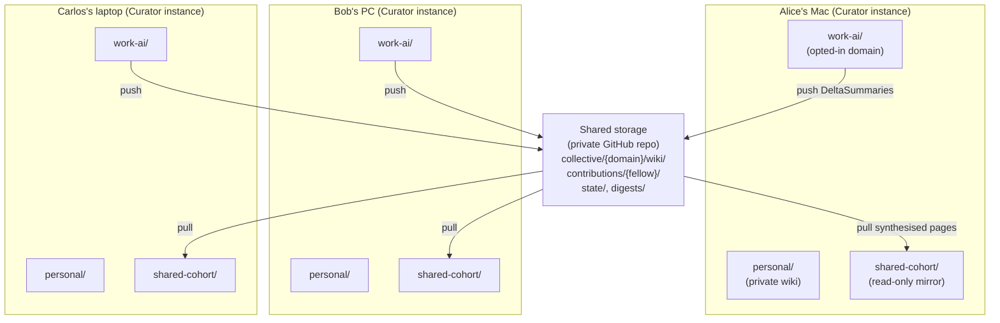
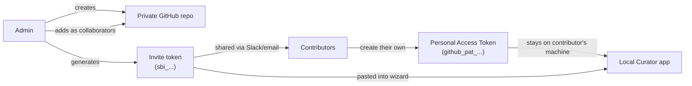
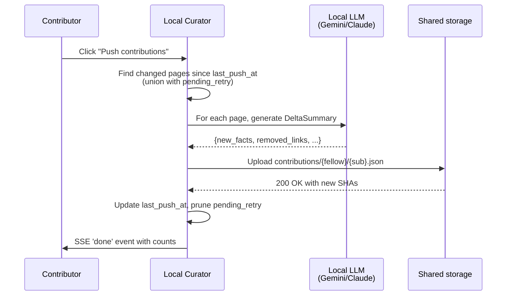
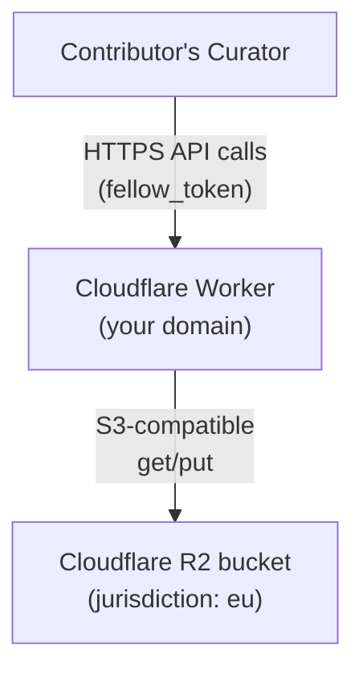

# Shared Brain — Concept & Architecture

**For**: anyone evaluating, deploying, or contributing to a Shared Brain. Explains what it is, how it works internally, the security model, the design decisions, and the v3.x+ roadmap.
**You probably want**: [User Guide](shared-brain-user-guide.md) for step-by-step instructions · [Admin Operations](shared-brain-admin.md) for advanced admin ops · [Compliance Reference](shared-brain-compliance.md) for GDPR / IP / EU residency.

---

## 1 — What it is

A **Shared Brain** is a **collective Curator wiki** that several people contribute to together — a cohort of students, a research team, a small company department. Each person keeps their own private Curator with their own private wiki. They additionally **opt one or more of their personal domains into the Shared Brain**. Those opted-in pages get pushed to a shared GitHub repository; the Curator pulls the synthesised collective wiki back to every contributor's machine as a read-only mirror domain.

You keep your private brain private. You only share what you choose. The collective wiki compounds with every contribution, and every contributor sees the same final pages.

**Why an LLM is required, and where it runs.** Mechanical file merge produces a bigger wiki. LLM synthesis produces a *better* wiki — resolving conflicting formulations, eliminating broken cross-fellow wikilinks, enriching sparse pages, attributing provenance. The LLM runs **locally on each contributor's machine** (using the Gemini Flash Lite key they already have configured for ingest), pre-processing their changed pages into compact `DeltaSummary` objects before pushing. The collective brain receives structured knowledge summaries — not raw wiki files.

**Status**: v3.0.0-beta.1, opt-in. Storage backend is GitHub-only in v3.0; Cloudflare R2 lands in v3.1 (see [Roadmap](#7--roadmap)).

---

## 2 — How it relates to Personal Sync

Personal Sync (the existing feature in v2.x) and Shared Brain (new in v3.0.0-beta) solve different problems. You can use either, both, or neither.

| | Personal Sync (v2.x) | Shared Brain (v3.0.0-beta+) |
|---|---|---|
| Number of people | 1 — just you | Many — a cohort or team |
| What gets synced | Your **entire** wiki + chat history | Only **opted-in domains**; LLM-synthesised summaries, not raw drafts |
| Where it lives | Your **own** private GitHub repo | The cohort's **shared** private GitHub repo |
| Who can write | Just you | Every contributor pushes; synthesis merges |
| Direction | Bidirectional sync | Push (contribute) + Pull (mirror) — never both in one operation |
| Visible in Curator | Pages are part of your personal wiki | Pages appear as a separate `shared-<slug>/` domain in your local app |
| Required infrastructure | A private GitHub repo + your own PAT | A private GitHub repo + per-contributor PATs + an admin's PAT |

Both features live in the **Sync** tab of the Curator app, in separate sections.

---

## 3 — Architecture

### The three layers



**Layer 1 — Individual Curator instances** (local, sovereign). Each contributor's `personal/` and other private domains stay on their own machine. Only opted-in domains push to shared storage. The synthesised collective wiki comes back as a separate read-only mirror domain.

**Layer 2 — Shared Brain Storage** (pluggable adapter). An abstract `SharedBrainStorageAdapter` interface with concrete implementations. v3.0 ships `GitHubStorageAdapter`; v3.1 adds `CloudflareR2Adapter`. Layer 3 modules (push, pull, synthesize, revoke) talk only to the abstract interface — backend-agnostic.

**Layer 3 — Storage backends** (the actual durable storage).

### Storage layout (identical across all adapters)

```
collective/<domain>/wiki/entities/*.md
collective/<domain>/wiki/concepts/*.md
collective/<domain>/wiki/summaries/*.md
collective/<domain>/wiki/index.md, log.md
contributions/<fellow_id>/<submission_id>.json    ← raw contribution payloads
digests/<fellow_id>/latest.json                    ← per-fellow synthesis cache
meta/state/last-synthesis.json                     ← coordination state
state/revocations.jsonl                            ← audit log for revocations
```

### Module map (where to read the code)

| Module | Purpose |
|---|---|
| `src/brain/sharedbrain-storage.js` | Abstract `SharedBrainStorageAdapter` interface (15 methods) |
| `src/brain/sharedbrain-local-adapter.js` | `LocalFolderStorageAdapter` (for battle testing — never used in production) |
| `src/brain/sharedbrain-github-adapter.js` | `GitHubStorageAdapter` (v3.0 production backend) |
| `src/brain/sharedbrain-storage-factory.js` | `createStorageAdapter(connection)` — dispatch by `storage_type` |
| `src/brain/sharedbrain-config.js` | `.sharedbrain-config.json` read/write with token masking |
| `src/brain/sharedbrain-delta.js` | Local-LLM `DeltaSummary` generation + Jaccard helper |
| `src/brain/sharedbrain.js` | `pushDomain` + `pullCollective` + `ensureSharedDomainExists` orchestration |
| `src/brain/sharedbrain-synthesis.js` | `runLocalSynthesis` — applies merge rules 1-5 |
| `src/brain/sharedbrain-revoke.js` | Article 17 revocation orchestration |
| `src/routes/sharedbrain.js` | 11 HTTP endpoints under `/api/sharedbrain/*` |
| `mcp/util.js` → `refuseIfReadonly()` | Decision 7 readonly-mirror guard for MCP write tools |

---

## 4 — The two primitives — invite token vs PAT

This is the **single most important concept** to understand. Confusing these two is the source of most setup mistakes.

| | Invite token (`sbi_…`) | Personal Access Token (`github_pat_…`) |
|---|---|---|
| Created by | The admin, once at brain setup | **Each contributor, on their own** |
| What it contains | Metadata only: repo name, brain name, branch, folder slug, data-handling-terms | A GitHub credential — the contributor's identity for write access |
| Shared with | The whole cohort (Slack, email — it's public-ish) | NOBODY. Stays only on the contributor's machine. |
| Grants access? | **No.** The token is just a label that helps the wizard fill in the repo URL. | Yes — this IS the actual GitHub authentication |
| Number per cohort | 1 (the admin generates one and shares it) | N (one per contributor) |

### The trust model visualised



### Why each contributor needs their own PAT — not one shared token

If the admin shared one PAT with everyone:

| Bad outcome | Why |
|---|---|
| All contributions look like the admin wrote them | Provenance broken — Decision 6a defeated |
| Revoking one student means revoking ALL students | One PAT → one revoke button |
| One leaked PAT compromises the whole brain | All write access tied to one credential |
| Loses per-fellow-revocation, the core security guarantee | Decision 1 explicitly forbids this |

**Decision 1 (binding): per-fellow fine-grained PAT.** Each person, their own token. See [§5 Decision 1](#decision-1--pat-security-model) for the full reasoning.

### Invite token format

`sbi_<base64url-encoded JSON>` with `v: 1` versioning:

```json
{
  "v": 1,
  "storage_type": "github",
  "repo": "your-org/cohort-brain",
  "name": "Spring 2026 ML Cohort",
  "shared_domain": "work-ai",
  "branch": "main",
  "data_handling_terms": "contributor_retains"
}
```

- **`sbi_` prefix**: same shape as GitHub's `github_pat_` — signals "this is a Shared Brain Invite". Easy to grep for accidentally-pasted tokens in logs.
- **`base64url` not standard base64**: URL-safe so the token can be shared in a link without encoding issues.
- **`v: 1` first field**: future-proofing. v2+ might add new fields; older clients gracefully degrade.
- **No credentials inside**: passes any secret-scanning tool.

---

## 5 — Engineering decisions (binding)

These decisions were settled in Phase 1 of the Shared Brain rollout (2026-05-14) before any code was written. They remain binding on the implementation. Future changes require an explicit "Decision Revisions" section.

### Decision 1 — PAT security model

**Decision: Per-fellow fine-grained PAT with repo-level write access. No path-level scoping in v1.**

**Why:** Fine-grained PATs as of early 2026 scope to a repository and a permission category — they do NOT scope to a path within a repo. Per-fellow path scoping via PAT is therefore not implementable with PAT mechanics alone; it requires branch protection (paid plan) plus a synthesis bot, or a GitHub App with installation tokens. Both add infrastructure that's wrong for v1.

Per-fellow fine-grained PATs give the one critical security property — *per-fellow revocation* — without any new infrastructure. Compromise of one PAT lets that attacker corrupt the collective repo, but: (a) the org can revoke that single PAT independently, (b) git history is fully preserved for rollback, (c) this matches the realistic non-adversarial threat model (carelessness, not targeted attack).

**Branch protection mode + GitHub App mode are explicitly deferred** to v3.1 (high-security mode) and v3.2 (enterprise) respectively.

### Decision 2 — Cross-domain link contamination

**Decision: Strict domain-link filtering at delta-generation time.**

**Why:** Deterministic, requires no coordination, no central state. Cross-domain references survive in prose (as `new_facts` bullet text); only the *graph edge* is dropped. Synthesis can later re-link if the same entity becomes a collective page.

Implemented in `filterToDomainLinks(links, domainPageSlugs)` in `src/brain/sharedbrain-delta.js`. Builds a Set from `getAllPagePaths(wikiDir)` and intersects `new_links` and `removed_links` against it.

### Decision 3 — LLM pre-processing failure handling

**Decision: Partial push, with explicit `pending_retry` state.**

**Why:** A student hitting a Gemini quota mid-week should not block their whole cohort contribution. Partial push delivers what worked; failed pages retry next cycle.

Implementation:
- `.sharedbrain-config.json` connection gains `last_push_at` (set BEFORE push starts) + `pending_retry: { [pagePath]: attemptCount }`.
- `findChangedPages(wikiDir, sinceDate, pendingRetry)` returns the union of (mtime > sinceDate) ∪ (paths in `pending_retry`).
- A page that fails 3 consecutive times moves to `permanent_skip` and is surfaced in the UI.
- User-visible push result: `"Pushed 7 of 10 pages. 3 will retry next time."`

### Decision 4 — Conflict resolution

**Decision: Union merge by default; targeted LLM call only for heuristic-flagged contradictions. Unresolved contradictions marked with a Health-scannable marker.**

**Why:** Most contributions don't conflict. Same fact stated differently is the main "conflict" case — that's resolved by exact-string dedup or near-duplicate dedup. Genuine value-conflicts ("coined in 2024" vs "coined in 2023") are rare. Invoking the LLM only when needed keeps synthesis cost proportional to disagreement, not corpus size.

**Heuristic for contradiction candidates (no LLM call):**

```
For each pair (a, b) of incoming new_facts on the same page:
  - Normalise: lowercase, strip punctuation, drop stop-words
  - Tokenise into word sets
  - similarity = |A ∩ B| / |A ∪ B|   (Jaccard)
  - similarity == 1.0          → exact duplicate, drop one
  - 0.5 ≤ similarity < 1.0     → flag as candidate contradiction (goes to LLM)
  - similarity < 0.5           → independent facts, keep both
```

**Markup for unresolved contradictions** (when LLM picks `both`):

```markdown
- ⚠️ CONFLICTING SOURCES — review needed:
  - Context Engineering coined in 2024 *(per fellow-a3f9)*
  - Context Engineering coined in 2023 *(per fellow-b7c1)*
```

Implementation: pure-JS `jaccardSimilarity(textA, textB)` helper, no NLP libraries. Health scanner detects the marker via regex; the user resolves interactively by editing the upstream personal opted-in domain and re-pushing.

### Decision 5 — Domain isolation

**Decision: Strict siloing. No symlinks. Pulled collective brain appears as its own sibling domain `domains/shared-<slug>/`.**

**Why:** Symlinks introduce two unknowns: (1) Obsidian's symlink graph traversal behaviour varies, (2) `resolveInsideBase()` in `mcp/storage/local.js` follows symlinks — would need a careful audit to confirm no path-traversal escape. Strict siloing has none of these unknowns.

The user-visible cost is real but bounded: Obsidian shows two disconnected sub-graphs (personal vs. collective). The MCP `search_cross_domain` tool already provides the cross-graph reasoning surface from Claude — this *is* the right answer for cross-domain questions.

Cross-domain link syntax (`[[shared:work-ai:openai]]`) is a v3.1+ roadmap item if user demand emerges.

### Decision 6 — GDPR / Data handling

**Decision: Privacy-first defaults with explicit two-flag opt-in for name attribution; mandatory admin-only revoke endpoint; configurable IP modes; EU residency documented as a deployment caveat.**

Full detail in [`docs/shared-brain-compliance.md`](shared-brain-compliance.md). Summary:

#### 6a. Provenance attribution — UUIDs default

The `## Provenance` section uses `fellow_id` (UUID) by default. Real names appear ONLY when BOTH flags are set:
- Org admin sets `allow_name_attribution: true` in the shared brain's admin config
- The individual contributor sets `attribute_by_name: true` in their local config

Either flag missing → UUID. Defensive double-gate — neither side can unilaterally surface someone's name.

#### 6b. Right to erasure (Article 17)

Mandatory v1 mechanism: `POST /api/sharedbrain/:id/revoke` with admin token + literal confirmation string. Operations: delete contributions → delete digest → scan + delete provenance-tainted collective pages → re-synthesize from remaining contributions → append `state/revocations.jsonl` audit entry. **Irreversible.** See [`docs/shared-brain-admin.md` §3](shared-brain-admin.md#3--revoking-a-contributor-article-17) and [`docs/shared-brain-compliance.md` §2](shared-brain-compliance.md#2--right-to-erasure-gdpr-article-17).

#### 6c. Enterprise IP modes

`data_handling_terms` field on the shared brain's admin config (encoded in the invite token so contributors' wizards see the matching consent):
- `"contributor_retains"` (default) — for educational cohorts; contributors keep copyright, organisation owns synthesised output.
- `"organisational"` — for enterprise with employment IP-transfer; contributors assign copyright at contribution time.

The wizard's consent checkbox text is rewritten accordingly. Locked once the admin shares the invite token.

#### 6d. EU data residency

Two adapter paths, two different stories:
- **Cloudflare R2** (v3.1+): supports per-bucket jurisdiction tagging — `jurisdiction = "eu"` in Wrangler config.
- **GitHub** (v3.0): data location is determined by the org's plan. Free / Pro / Team store data in the US. **GitHub Enterprise Cloud with EU data residency** required for EU compliance.

### Decision 7 — MCP write-tool guard on shared-* domains

**Decision: MCP write tools (`compile_to_wiki`, `fix_wiki_issue`, etc.) refuse to write to domains where the `CLAUDE.md` frontmatter declares `readonly: true`. Contributions to a Shared Brain flow through the user's personal opted-in domain, not direct writes to the mirror.**

**Why:** Without this guard, Claude (via MCP) could compile findings directly into `domains/shared-X/`. Those writes would (a) not propagate to other contributors (no push path from a mirror domain) and (b) be silently overwritten on next pull. The contribution model only works if writes originate from the personal opted-in domain.

Implementation: `ensureSharedDomainExists()` writes `domains/shared-<slug>/CLAUDE.md` with `readonly: true` frontmatter. New helper `isDomainReadonly(domain)` in `src/brain/files.js`. The MCP `refuseIfReadonly()` chokepoint in `mcp/util.js` is called from all four write tools — refuses with a structured error pointing the user back to their personal opted-in domain.

The Claude skill (`claude-skills/my-curator/SKILL.md` §3.1) documents this read/write contract from Claude's perspective so it knows where to compile when the user says "save this to the shared brain".

### Deferred (no decision needed for v1)

| Topic | Resolution |
|---|---|
| Deletion propagation | **Defer to v3.1.** Zombie pages will accumulate; Health's orphan detection surfaces them. |
| Corpus scale ceiling | **Defer.** For cohort-scale (≤500 pages), no special handling. |
| Worker vs Node code sharing | **Defer to v3.1.** When the Cloudflare R2 adapter ships, synthesis pipeline will be written in dependency-free JS that bundles cleanly for both targets. |

---

## 6 — Data flow

### Push (every contributor)



Per Decision 3, partial pushes succeed: failed pages enter `pending_retry` and retry next cycle.

### Pull (every contributor)

`pullCollective(connection)` lists every page in `collective/<domain>/wiki/` via the adapter's `listPages()`, then for each: `resolveInsideBase()` security check, then writes via existing `writePage(shared-<X>, path, content)` — re-uses the ingest write pipeline (merge, dedup, frontmatter, backlinks, all automatic via v2.5.5+ machinery).

### Synthesize (admin)

Triggered weekly or on admin demand. Per Decision 4, applies rules 1-5:

- **Rule 1** — Union new_facts; exact-string dedup
- **Rule 2** — Union/subtract links per spec (Decision 2 filter enforces same-domain only)
- **Rule 3** — Jaccard heuristic flags near-duplicate facts; targeted LLM resolves each
- **Rule 4** — Provenance section auto-appended with contributor UUIDs (or names if both attribution flags on, per Decision 6a)
- **Rule 5** — Collective `index.md` rebuilt

Runs locally on admin's machine. Collective storage just receives the written pages — no cloud compute.

### Revoke (admin, GDPR Article 17)

Per Decision 6b:
1. Delete all `contributions/<fellow_id>/*.json`
2. Delete `digests/<fellow_id>/latest.json`
3. Scan all collective pages; delete any whose Provenance section references the revoked fellow
4. Reset `meta/state/last-synthesis.json` to epoch
5. Re-run synthesis from scratch (rebuilds remaining pages, leaves zero-contributor pages deleted)
6. Append entry to `state/revocations.jsonl` (UUID + timestamp + sha256-hashed admin token + counts; NO PII)

Irreversible. Documented prominently in admin guide and compliance reference.

---

## 7 — Roadmap

### v3.0.0-beta.1 (this release) — GitHub-backed Shared Brains

- One storage backend: GitHub via REST API with fine-grained PATs
- Contributor + admin wizard with invite-token UX
- Push / Pull / Synthesize / Revoke (API-only revoke)
- MCP guard refuses direct writes to `shared-*` mirrors
- Compliance documentation

### v3.0.0 GA (planned)

- Admin Revoke UI in Settings → Advanced
- Bug fixes from beta feedback
- Polish on the wizard flow (better error messages, retry guidance)
- More worked examples in the user guide

### v3.1 — Cloudflare R2-backed Shared Brains

Adds a second storage backend designed for organisations that want EU data residency, custom domain endpoints, or zero-egress-cost reads.



Compared with GitHub mode:

| | GitHub (v3.0) | Cloudflare R2 (v3.1) |
|---|---|---|
| Storage backend | GitHub repo | R2 bucket |
| Authentication | Fine-grained PAT per contributor | Per-fellow token issued by the Worker |
| EU residency | Requires Enterprise Cloud | Single config flag (`jurisdiction = "eu"`) |
| Custom domain | github.com/owner/repo | brain.your-org.com |
| Self-hosting effort | Zero (use GitHub directly) | Modest (deploy Worker + bucket) |
| Best for | Cohorts, research groups, small orgs | Organisations with privacy/residency requirements |

The Cloudflare R2 path requires deploying a small Cloudflare Worker (we'll ship the Wrangler config and Worker source code). Once deployed, contributors paste the Worker's URL + their fellow_token instead of a GitHub repo + PAT. Otherwise the wizard is identical.

Also in v3.1: deletion propagation (currently a known limitation) and `[[shared:work-ai:openai]]` cross-domain link syntax if user demand emerges.

### v3.2 — Enterprise mode (further out)

- GitHub App installations instead of per-fellow PATs (eliminates per-user PAT creation)
- Path-level permissions (contributors can only write to their assigned sub-folders)
- SSO integration (SAML/SCIM)
- Audit log export to external SIEM (Splunk, Datadog, etc.)

This requires either a hosted GitHub App or organisation-managed installations. Best fit for compliance-heavy enterprise deployments.

### Beyond v3.2

- **Branch-per-cohort mode** — single repo serving multiple parallel cohorts (course sections, research subgroups) with branch-protected writes.
- **Diff history UI** — visualise what changed in the collective wiki between synthesis runs.
- **Roll-up dashboards** — admin sees contribution velocity, conflict-marker counts, orphan rates per cohort.
- **Synthesis automation** — scheduled / triggered automatic synthesis without manual admin click.

None of these are committed; they're items in the backlog we'd evaluate after v3.x has real cohort deployments to learn from.

---

## 8 — Source-of-truth map

| Document | Purpose | Mutability |
|---|---|---|
| `docs/shared-brain.md` (this doc) | Concept + architecture + decisions | Append-only between releases; decisions revisable only with explicit user agreement in a "Decision Revisions" section |
| [`docs/shared-brain-user-guide.md`](shared-brain-user-guide.md) | Step-by-step user guide for contributors + admins (setup, daily workflow, troubleshooting) | Lives forever, updated each release |
| [`docs/shared-brain-admin.md`](shared-brain-admin.md) | Advanced admin operations (synthesis cadence, revocation, contributor management, admin-token security) | Lives forever |
| [`docs/shared-brain-compliance.md`](shared-brain-compliance.md) | GDPR / IP / EU residency reference for organisations evaluating deployment | Lives forever, updated when compliance posture changes |
| `CLAUDE.md` | Per-version history entries — engineering notes per release | Append-only |

---

## 9 — Quick links to operational guides

- **I want to join a Shared Brain** → [`docs/shared-brain-user-guide.md` §2](shared-brain-user-guide.md#2--contributor-setup-join-an-existing-shared-brain)
- **I want to start a Shared Brain** → [`docs/shared-brain-user-guide.md` §3](shared-brain-user-guide.md#3--admin-setup-start-a-new-shared-brain)
- **Daily workflow** → [`docs/shared-brain-user-guide.md` §4](shared-brain-user-guide.md#4--daily-workflow)
- **Something broke** → [`docs/shared-brain-user-guide.md` §5](shared-brain-user-guide.md#5--troubleshooting)
- **I'm an admin and need to run synthesis / revoke someone** → [`docs/shared-brain-admin.md`](shared-brain-admin.md)
- **My org is evaluating compliance** → [`docs/shared-brain-compliance.md`](shared-brain-compliance.md)
