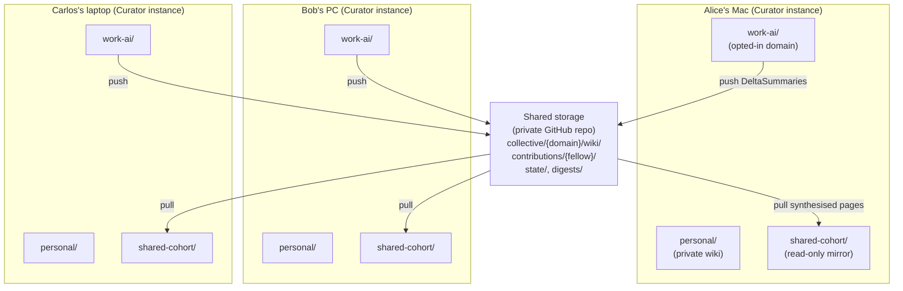
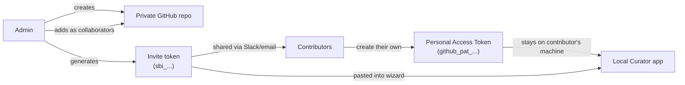
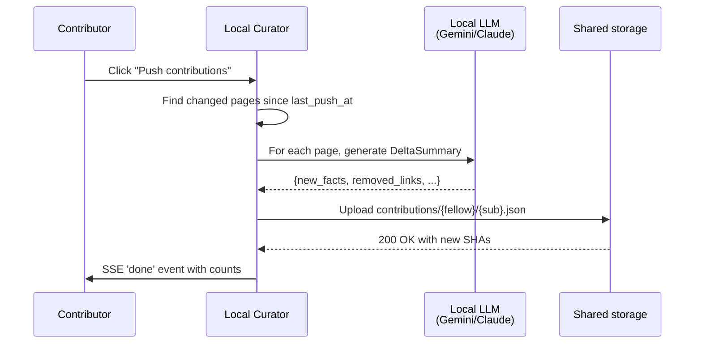
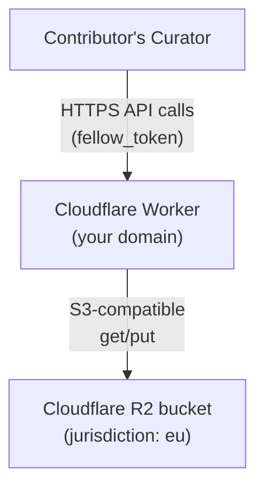

# Shared Brain — User Guide

**For**: anyone who wants to contribute to a collective wiki shared with a cohort, team, or research group.
**Status**: v3.0.0-beta.1 — beta, opt-in, GitHub-backed only.
**Companions**: [`docs/shared-brain-admin.md`](shared-brain-admin.md) (admin operations) · [`docs/shared-brain-compliance.md`](shared-brain-compliance.md) (GDPR / IP / residency) · [`docs/shared-brain-design.md`](shared-brain-design.md) (engineering decisions)

---

## 1 — What it is, in one paragraph

A Shared Brain is a **collective Curator wiki** that several people contribute to together — a cohort of students, a research team, a small company department. Each person keeps their own private Curator and their own personal wiki. They additionally opt one or more of their personal domains into the Shared Brain. Those opted-in pages get pushed to a shared GitHub repository; the Curator pulls the synthesised collective wiki back to every contributor's machine as a read-only mirror.

You keep your private brain private. You only share what you choose. The collective wiki compounds with every contribution, and every contributor sees the same final pages.

---

## 2 — How it relates to Personal Sync

Personal Sync (the existing feature in v2.x) and Shared Brain (new in v3.0.0-beta) solve different problems. You can use either, both, or neither.

| | Personal Sync (v2.x) | Shared Brain (v3.0.0-beta+) |
|---|---|---|
| Number of people | 1 — just you | Many — a cohort or team |
| What gets synced | Your **entire** wiki + chat history | Only **opted-in domains**; LLM-synthesised summaries, not raw drafts |
| Where it lives | Your **own** private GitHub repo | The cohort's **shared** private GitHub repo |
| Who can write | Just you | Every contributor pushes; synthesis merges |
| Direction | Bidirectional | Push (contribute) and Pull (mirror) — never both in one operation |
| Visible in Curator | Pages are part of your personal wiki | Pages appear as a separate `shared-<slug>/` domain in your local app |

Both features live in the **Sync** tab of the Curator app, in separate sections.

---

## 3 — Architecture

Each contributor's `personal/` and other private domains stay on their own machine. Only the opted-in `work-ai/` domain pushes to shared storage. The synthesised collective wiki comes back as a separate read-only mirror domain.

---

## 4 — The two primitives — invite token vs PAT

Confusing these two is the single biggest mistake people make. They are **completely different things**.

| | Invite token (`sbi_…`) | Personal Access Token (`github_pat_…`) |
|---|---|---|
| Created by | The admin, once at brain setup | **Each contributor, on their own** |
| What it contains | Metadata only: repo name, brain name, branch, folder slug | A GitHub credential — the contributor's identity for write access |
| Shared with | The whole cohort (Slack, email — it's public-ish) | NOBODY. Stays only on the contributor's machine. |
| Grants access? | **No.** The token is just a label that helps the wizard fill in the repo URL. | Yes — this is the actual GitHub authentication |
| Number per cohort | 1 (the admin generates one and shares it) | N (one per contributor) |

**Why each contributor needs their own PAT** (not one shared token): provenance, per-fellow revocation, no single point of failure. If your admin shares one PAT with everyone, you lose all three properties. See [`docs/shared-brain-design.md` Decision 1](shared-brain-design.md#decision-1--pat-security-model-was-oq-01).

---

## 5 — Joining a Shared Brain (contributor flow)

This is the path 95% of users take. You received an invite token from an admin; you're going to join.

### Prerequisites

- A GitHub account (free is fine).
- The admin has **added you as a collaborator** on the shared repo. You should have received an email from GitHub saying *"<admin> invited you to <repo>"*. **Accept it before starting** — the Curator wizard can't grant you GitHub access; that's GitHub's job via collaborator invitations.

### The six steps in the wizard

1. **Token**. Open the Sync tab in the Curator app, scroll to "Shared Brains". If you haven't yet, click **Enable Shared Brain (beta)** to opt into the feature. Then click **📨 Join → Join**. Paste your invite token (`sbi_…`) — the wizard decodes and previews the metadata.
2. **Access**. The wizard reminds you to accept the GitHub email invitation. Click **"I've accepted — continue →"** when done. (You can also click the *Open the repo on GitHub* link to verify your access by visiting the repo.)
3. **PAT**. Click **Open GitHub to create my token →**. The button opens GitHub's fine-grained PAT page with the token name prefilled. Set **Repository access** → *Only select repositories* → pick the cohort repo. Set **Permissions** → add **Contents** → set to **Read and write**. Click **Generate token**. Copy the `github_pat_…` string GitHub shows once. Paste it back into the Curator wizard. Within ~400ms a green ✓ confirms the token works against the cohort repo.
4. **Domains**. Pick which of your personal domains contribute to this Shared Brain. The list excludes any existing `shared-*` mirrors so you can't contribute from one mirror to another. Pick a display name (this is for your own contributions' Provenance section, not visible elsewhere).
5. **Consent**. The consent text varies based on the admin's data-handling-terms choice (see [compliance §3](shared-brain-compliance.md#3--copyright--ip--two-modes)). Read it carefully. Tick the consent checkbox.
6. **Save & Connect**. The wizard saves your connection. You'll see a new card in the Sync tab with **Push contributions** and **Pull updates** buttons.

### Daily workflow after setup

- **After ingesting new sources** into your contributing domain → click **Push contributions** on the connection card. Your local Curator runs LLM pre-processing, then pushes Delta summaries to the shared repo.
- **Before reading the collective wiki** → click **Pull updates**. Your local `shared-<slug>/` mirror domain gets the latest synthesised pages.
- **Open Claude Desktop with My Curator MCP** → the synthesised collective wiki is available as a domain you can `search_wiki`, `get_node`, etc. Write tools (`compile_to_wiki`, `fix_wiki_issue`) refuse to touch the mirror — direct writes wouldn't propagate. To contribute, use those tools on your personal opted-in domain instead, then Push.

---

## 6 — Starting a Shared Brain (admin flow)

Only one person per cohort runs this. It's a one-time setup.

### Prerequisites

- A GitHub account (free is fine for personal repos; Enterprise Cloud with EU residency if you need EU compliance — see [compliance §4](shared-brain-compliance.md#4--eu-data-residency)).
- Names / emails / GitHub usernames of your contributors.

### Step A — Create the private repo on GitHub

1. Go to https://github.com/new
2. Repository name: anything that describes the cohort. Visibility: **Private**. Initialise with a README so the `main` branch exists.
3. After creation, go to **Settings → Collaborators → Add people**. Type each contributor's GitHub username or email. GitHub sends them an invitation email. Wait for them to accept.

### Step B — Run the admin wizard

1. In the Curator app, Sync tab → Shared Brains → click **⚙️ Set up new Shared Brain → Set up**.
2. The wizard's progress bar shows: **Setup → Invite → PAT → Domains → Save**.
3. Step 1 — Setup. Paste the repo full name (owner/name). Pick a friendly **Brain name** ("Spring 2026 ML Cohort"). The **Folder inside the repo** auto-fills from the name; you can override. Pick **Data handling terms**:
   - **Contributor retains copyright** — default, for cohorts and research groups
   - **Organisational (IP transfer)** — for enterprise deployments with IP-assignment clauses in employment contracts
4. Step 2 — Invite. The wizard generates an invite token (`sbi_…`) and a numbered checklist with the link to **Settings → Collaborators** on the new repo. Copy the invite token to your clipboard, share it with contributors via Slack/email.
5. Steps 3-5 — your own contribution. As the admin you're also a contributor; finish your own PAT + domains + consent (same six steps as a regular contributor).

### Step C — Brief your contributors

Send each contributor:
- The invite token (`sbi_…`)
- Reminder to accept the GitHub collaborator invitation email
- A link to this user guide for the rest of the flow

---

## 7 — Push, Pull, Synthesize — what they do

Each connection card in the Sync tab has three actions:

- **Push contributions** (every contributor). Walks your contributing domain's wiki, finds pages changed since your last push, runs local LLM pre-processing on each, uploads DeltaSummary JSON files to the shared repo. Per Decision 3, if some pages fail (LLM quota, parse errors) the rest still upload; failed pages enter a retry queue.
- **Pull updates** (every contributor). Lists every page in `collective/<domain>/wiki/` and writes them into your local `shared-<slug>/` domain via the same writePage pipeline ingest uses (link grounding, frontmatter, backlinks — all the v2.5.5+ machinery runs).
- **Run synthesis (admin)** (typically run by the admin on a schedule — weekly is reasonable). Reads ALL contributions since the last synthesis, groups them per page, applies merge rules:
  - **Rule 1** — Union new_facts; exact-string dedup
  - **Rule 2** — Union/subtract links per spec
  - **Rule 3** — Jaccard heuristic flags near-duplicate facts as contradiction candidates → targeted LLM call resolves each → unresolved contradictions get a CONFLICTING SOURCES marker
  - **Rule 4** — Provenance section auto-appended with contributor UUIDs (or names if both attribution flags are on)
  - **Rule 5** — Collective `index.md` rebuilt to list every synthesised page

Synthesis runs locally on the admin's machine. The collective storage just receives the written pages — no cloud compute.

---

## 8 — Right to erasure (Article 17)

If a contributor leaves the cohort, the admin can revoke them. This permanently removes their contributions from the shared repo and rebuilds every affected collective page from the remaining contributors' submissions only.

In v3.0.0-beta.1 this is API-only (`POST /api/sharedbrain/:id/revoke` with admin token + confirmation string). v3.0.0 GA will add a Settings → Advanced → Revoke contributor UI.

Full procedure documented in [`docs/shared-brain-admin.md` §3](shared-brain-admin.md#3--revoking-a-contributor-article-17). GDPR Article 17 specifics in [`docs/shared-brain-compliance.md` §2](shared-brain-compliance.md#2--right-to-erasure-gdpr-article-17).

---

## 9 — Roadmap

### v3.0.0-beta.1 (this release) — GitHub-backed Shared Brains

- One storage backend: GitHub via REST API with fine-grained PATs
- Contributor + admin wizard with invite-token UX
- Push / Pull / Synthesize / Revoke (API-only revoke)
- MCP guard refuses direct writes to `shared-*` mirrors
- Compliance documentation

### v3.0.0 GA (planned)

- Admin Revoke UI in Settings → Advanced
- Bug fixes from beta feedback
- Polish on the wizard flow (better error messages, retry guidance)
- More worked examples in the user guide

### v3.1 — Cloudflare R2-backed Shared Brains

Adds a second storage backend designed for organisations that want EU data residency, custom domain endpoints, or zero-egress-cost reads.

Compared with GitHub mode:

| | GitHub (v3.0) | Cloudflare R2 (v3.1) |
|---|---|---|
| Storage backend | GitHub repo | R2 bucket |
| Authentication | Fine-grained PAT per contributor | Per-fellow token issued by the Worker |
| EU residency | Requires Enterprise Cloud | Single config flag (`jurisdiction = "eu"`) |
| Custom domain | github.com/owner/repo | brain.your-org.com |
| Self-hosting effort | Zero (use GitHub directly) | Modest (deploy Worker + bucket) |
| Best for | Cohorts, research groups, small orgs | Organisations with privacy/residency requirements |

The Cloudflare R2 path requires deploying a small Cloudflare Worker (we'll ship the Wrangler config and Worker source code). Once deployed, contributors paste the Worker's URL + their fellow_token instead of a GitHub repo + PAT. Otherwise the wizard is identical.

### v3.2 — Enterprise mode (further out)

- GitHub App installations instead of per-fellow PATs (eliminates per-user PAT creation)
- Path-level permissions (contributors can only write to their assigned sub-folders)
- SSO integration (SAML/SCIM)
- Audit log export to external SIEM

This requires either a hosted GitHub App or organisation-managed installations. Best fit for compliance-heavy enterprise deployments.

### Beyond v3.2

- **Cross-domain links** (`[[business:openai]]` syntax) — explicitly link from one personal domain to another, or between personal and shared. Requires parser/scanner work across health.js, compile.js, and MCP tools.
- **Branch-per-cohort mode** — single repo serving multiple parallel cohorts (course sections, research subgroups) with branch-protected writes.
- **Diff history UI** — visualise what changed in the collective wiki between synthesis runs.
- **Roll-up dashboards** — admin sees contribution velocity, conflict-marker counts, orphan rates per cohort.

None of these are committed; they're items in the backlog we'd evaluate after v3.x has real cohort deployments to learn from.

---

## 10 — When things go wrong

### "Your token does not have write access"
You created the PAT with **Contents: Read-only**. Go back to GitHub and regenerate with **Contents: Read and write**, then re-paste in the wizard.

### "GitHub rejected the token"
- The PAT was copied incompletely. GitHub shows it once — copy carefully.
- The admin hasn't added you as a collaborator yet. Check your email for the GitHub invitation and accept it.
- The PAT was scoped to the wrong repo. Re-create and select the cohort repo specifically.

### "Repository not found"
The admin gave you the wrong repo URL, OR you haven't accepted the collaborator invitation yet. Re-check both.

### Push says "0 of 0 pages" but you added new content
The contributing domain's pages were ingested before your last push timestamp. Either edit one page (touches mtime) to force re-push, OR ask the admin to run synthesis — they may have run it after your last push without you knowing.

### Synthesis is asking the LLM and slow
Synthesis only calls the LLM for contradictions detected via the Jaccard heuristic. If the collective wiki has many contradictions, each takes one LLM call (small — ~200 tokens). On a 100-page brain with 5 contradictions, total LLM calls are about 5 — usually well under a minute.

### `shared-<slug>` domain shows up but I can't compile to it from Claude
That's by design (Decision 7). The mirror is read-only — direct writes wouldn't propagate. Compile to your personal opted-in domain instead, then Push.

### My personal data is in the wiki — is it on GitHub now?
**Only if you opted-in a domain that contained that data.** Personal Sync (which mirrors your entire wiki) and Shared Brain (which pushes only opted-in domains' contributions) are independent. Review what's in your opted-in domains before pushing.

---

## 11 — Quick reference

| Action | Where |
|---|---|
| Enable Shared Brain (beta) | Sync tab → "Enable Shared Brain (beta)" button |
| Join a cohort | Sync tab → 📨 Join → Join → paste invite token |
| Start a new cohort | Sync tab → ⚙️ Set up new Shared Brain → Set up |
| Push your contributions | Connection card → "Push contributions" |
| Pull collective updates | Connection card → "Pull updates" |
| Run synthesis (admin) | Connection card → Advanced → "Run synthesis" |
| Revoke a contributor | `POST /api/sharedbrain/:id/revoke` (UI coming v3.0.0 GA) |
| Disconnect this machine | Connection card → Advanced → "Disconnect" |
| Read the design decisions | [`docs/shared-brain-design.md`](shared-brain-design.md) |
| Read the admin operations guide | [`docs/shared-brain-admin.md`](shared-brain-admin.md) |
| Read the compliance reference | [`docs/shared-brain-compliance.md`](shared-brain-compliance.md) |
